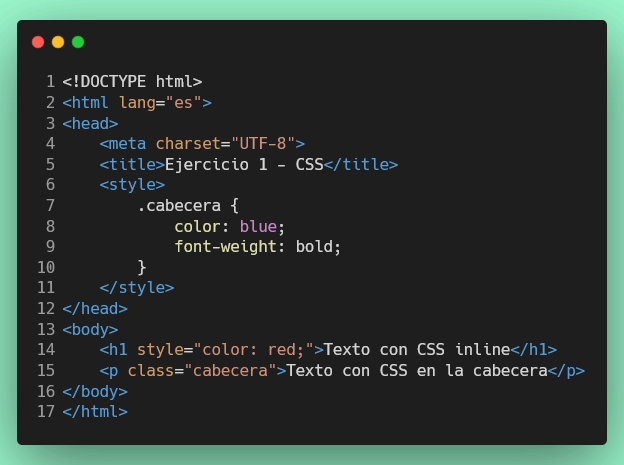

# Ejercicio 1: Uso de CSS

## Visualización del Ejercicio

Para visualizar este ejercicio con Live Server:

1. Asegúrate de tener la extensión **Live Server** instalada en VS Code
2. Abre el archivo [src/index.html](../src/index.html)
3. Haz clic derecho sobre el archivo y selecciona **"Open with Live Server"**
4. En la página principal, haz clic en el enlace **"Ejercicio 1: Uso de CSS"**

---

## Objetivo

Crea un archivo HTML que muestre un texto y aplica estilos de dos formas:

1. **CSS inline** usando el atributo `style`.
2. **CSS en la cabecera** usando la etiqueta `<style>`.

---

## Ejemplo


---

## Tarea

1. Crea un archivo `src/ejercicio-1/css.html` con el ejemplo anterior.
2. Agrega un enlace en [src/index.html](../src/index.html) para acceder a este ejercicio:
   ```html
   <a href="ejercicio-1/css.html">Ejercicio 1: Uso de CSS</a>
   ```

## Puntuación

Este ejercicio vale **8 puntos** en total, distribuidos de la siguiente manera:

- **Test 1.1**: Archivo HTML existe (2 puntos)
- **Test 1.2**: CSS inline aplicado correctamente (2 puntos)
- **Test 1.3**: Párrafo con clase definida (2 puntos)
- **Test 1.4**: CSS en cabecera para la clase (2 puntos)

Cada test aprobado suma puntos parciales a tu calificación final de 100 puntos.

## Ejecución de Pruebas

Para ejecutar las pruebas localmente:

```bash
npm install
npm test
```