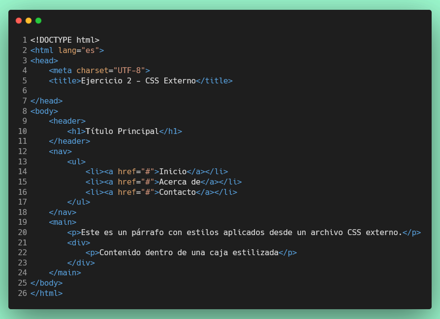
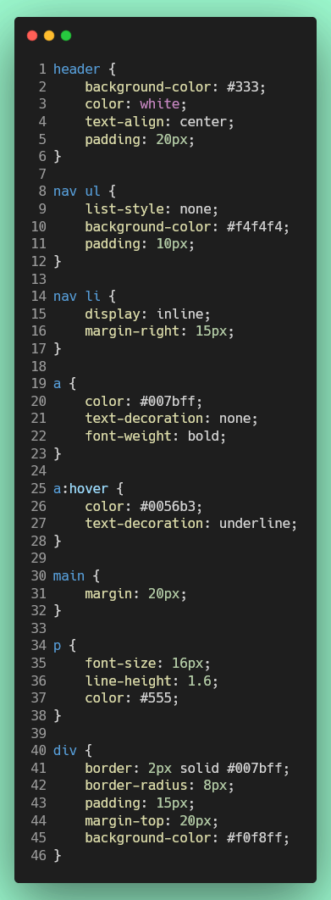

# Ejercicio 2: CSS Externo

## Visualización del Ejercicio

Para visualizar este ejercicio con Live Server:

1. Asegúrate de tener la extensión **Live Server** instalada en VS Code
2. Abre el archivo [src/index.html](../src/index.html)
3. Haz clic derecho sobre el archivo y selecciona **"Open with Live Server"**
4. En la página principal, haz clic en el enlace **"Ejercicio 2: CSS Externo"**

---

## Objetivo

Crea un archivo HTML que use estilos CSS desde un archivo externo para aplicar estilos a varios elementos HTML.

---

## Ejemplo

**Archivo HTML** (`ejercicio-2-css-externo.html`):



**Archivo CSS** (`estilos.css`):



---

## Tarea

1. Crea un archivo `src/ejercicio-2/css-externo.html` con el HTML del ejemplo.
2. Crea un archivo `src/ejercicio-2/estilos.css` con los estilos del ejemplo.
   - El archivo HTML enlaza correctamente al CSS externo.
   - Los elementos HTML están presentes (header, nav, main, etc.).
   - El archivo CSS contiene los selectores de etiquetas especificados.
3. Agrega un enlace en [src/index.html](../src/index.html) para acceder a este ejercicio:
   ```html
   <a href="ejercicio-2/css-externo.html">Ejercicio 2: CSS Externo</a>
   ```

## Probar su ejercicio

4. Utiliza el test que verifique el cumplimiento de los requerimientos.

## Puntuación

Este ejercicio vale **34 puntos** en total, distribuidos de la siguiente manera:

- **Test 2.1**: Archivos HTML y CSS existen (4 puntos)
- **Test 2.2**: Enlace CSS correcto (2 puntos)
- **Test 2.3**: Estructura HTML completa (6 puntos)
- **Test 2.4**: Estilos para header y nav (6 puntos)
- **Test 2.5**: Estilos para enlaces (4 puntos)
- **Test 2.6**: Estilos para main, p y div (6 puntos)
- **Test 2.7**: Estilos hover (2 puntos)
- **Test 2.8**: Verificación completa de estilos (4 puntos)

Cada test aprobado suma puntos parciales a tu calificación final de 100 puntos.

## Ejecución de Pruebas

Para ejecutar las pruebas localmente:

```bash
npm install
npm test
```